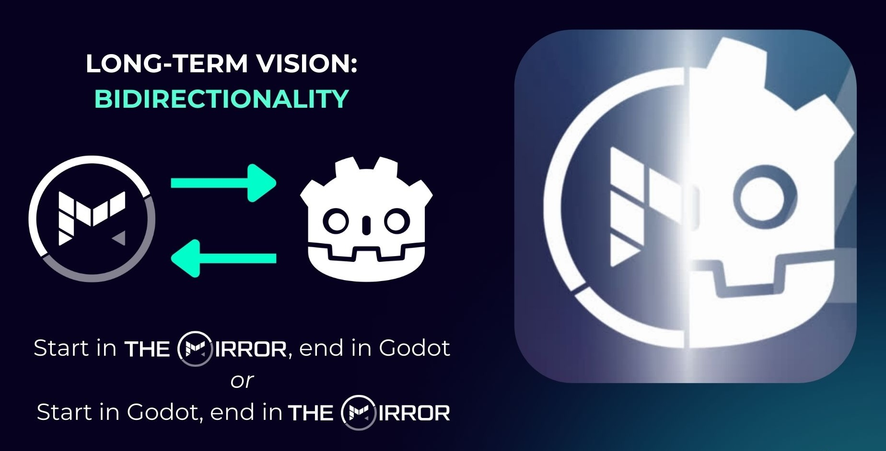

# Get Started

The **easiest** way is via our compiled Mirror Official app: [Get Started](https://docs.themirror.space/docs/get-started)

## Docs

[The docs site](https://docs.themirror.space/docs/open-source-code/get-started) (`/mirror-docs`) is our primary source of truth for documentation, not this README. We intend to keep this README slim since documentation is and will continue to be extensive.

# Features

- **[(Real) Real-Time Game Development](https://www.themirror.space/blog/real-real-time-game-development)**: Like Inception, the aim is to build worlds in real-time with friends, colleagues, and players. Read more about our approach on our blog [here](https://www.themirror.space/blog/real-real-time-game-development).
- **All-in-one game development**: The Mirror is both the editor and the game, providing everything you need out-of-the-box to quickly create and play games, digital experiences, virtual worlds, and more.
- **Editor**: Built-in and networked: A lightweight, real-time, multiplayer editor to build in real-time.
- **Physics** via [Jolt](https://github.com/jrouwe/JoltPhysics), a AAA physics engine used by Horizon Zero Dawn.
- **Advanced networking**: Keep your game in sync and rewind when things get out of sync.
- **Visual scripting**: Even if you don't know how to code, you can implement game logic quickly and easily.
- **Traditional coding**: GDScript in-world editor so you can live edit your game code. If you're new to GDScript, it's like Python, super newbie-friendly, and is easy to learn.
- **Material editor**: No need to exit the editor to make changes to your materials: Everything is in real-time
- **Shader editing**: Real-time shader editing with text will be available in the future
- **Asset management**: Assets are automatically stored in the cloud or via local storage (self-hosted) so you can simplify your workflows in real-time without needing to restart the editor. Much less hassle and easy collaboration with team members.
- **Open asset system**: Built around GLTF, The Mirror supports seats, lights, equipables, and custom physics shapes, all direct from Blender.
- **Mirror UI elements**, including a table class which can easily map _any_ data to UI elements without duplicating state in a performant way.
- **Collision shape generation**: Convex and concave supported
- **Audio**: Easily add audio to your game in real-time without opening a separate editor; no need to recompile
- **Player controllers**: Out-of-the-box FPS (first-person shooter), TPS (third-person shooter), and VR (virtual reality) supported.
- **VR-ready**: Just put on the tethered headset when playing! We test with Meta Quest 2 and 3.
- **Intentional architecture**: (Space)Objects are a simple game object abstraction with the aim of supporting **any** type of Godot node in the future.
- **Bidirectionality with Godot**: Start in The Mirror and end in Godot, or start in Godt and end in The Mirror. Our aim is to make it easy to transition between the two or develop side-by-side: your choice.
  
- **Godot plugin:** Coming soon

# Join the Community

**1. Join our [Discord](https://discord.com/invite/CK6fH3Cynk)**

**2. Check out our [Roadmap](https://github.com/orgs/the-mirror-gdp/projects/7)**

**3. Read our docs: [Site](https://docs.themirror.space), [monorepo `/mirror-docs`](https://github.com/the-mirror-gdp/the-mirror/tree/dev/mirror-docs)**

**4. Check out our [open-source announcement post](https://www.themirror.space/blog/freedom-to-own-open-sourcing-the-mirror)**

**5. Follow us on [X/Twitter](https://twitter.com/themirrorgdp)**

# What is The Mirror and why?

**_Freedom to own_**: The Mirror is a Roblox & UEFN alternative giving you the freedom to own what you create: an all-in-one game development platform built on Godot.

If you build on others like Roblox, UEFN/Unreal/Fortnite, and Unity, you don't actually own the full stack of what you build because you don't own the engine.

_**We're here to change that**_. 3D is arguably the next step of the internet and we can't let it be beholden to an oligopoly of companies that want to own your data and creations. The Mirror gives you the freedom to own what you build.

Akin to "Google Docs for game development", The Mirror is both the editor and the game that let's you build with friends in real-time. This saves you a plethora of time: Enjoy not having to write pesky things like infrastructure, backend HTTP routes, asset management, authentication, netsync, and various systems from scratch.

This repo is The Mirror's source code: the Godot app (client/server), the web server, and the docs in one place. We've included everything we can provide to help you build your games as fast as possible.

## Build the Open-Source Code

1. Git clone the repository (you do **not** need to clone with submodules; they are optional)
2. Download the precompiled Mirror fork of Godot engine (required to use)

- Windows: [Download](https://storage.googleapis.com/mirror_native_client_builds/Engine/a6443c6c/MirrorGodotEditorWindows.exe)
- Mac: **v buggy**; taking contributions for fixes :) [Download](https://storage.googleapis.com/mirror_native_client_builds/Engine/a6443c6c/MirrorGodotEditorMac.app.zip). On Mac you will see a zip file; extract it and open the editor binary with CMD + Right-Click then select the Open option.
- Linux: [Download](https://storage.googleapis.com/mirror_native_client_builds/Engine/a6443c6c/MirrorGodotEditorLinux.x86_64)

1. Open the Godot editor (The Mirror fork), click import, and choose the `project.godot` from the `/mirror-godot-app` folder.
   Note that if you see this popup, you can safely ignore it and proceed.

4. Close the Godot editor and open it again, to ensure that everything loads correctly, now that all files have been imported.
5. **Hit play in the Godot editor!**
6. Create a new Space, and you will automatically join it. Or, join an existing Space.

## Godot Fork

The Mirror is built on a custom fork of Godot and required to use The Mirror's code. The fork is open source and can be found [here](https://github.com/the-mirror-gdp/godot).

_Analytics Disclaimer: We use Posthog and Mixpanel and it automatically collects analytics in the open source repo. You can disable this manually by commenting out the `mirror-godot-app/scripts/autoload/analytics/analytics.gd` file methods. We are transitioning from Posthog to Mixpanel and Posthog will be removed in a future release. We will make this easier in the future to disable. The Mirror Megaverse Inc., a US Delaware C Corp, is the data controller of the Posthog and Mixpanel instances. You are free to disable the analytics and even plug in your own Posthog or Mixpanel API keys to capture the analytics yourself for your games!_
