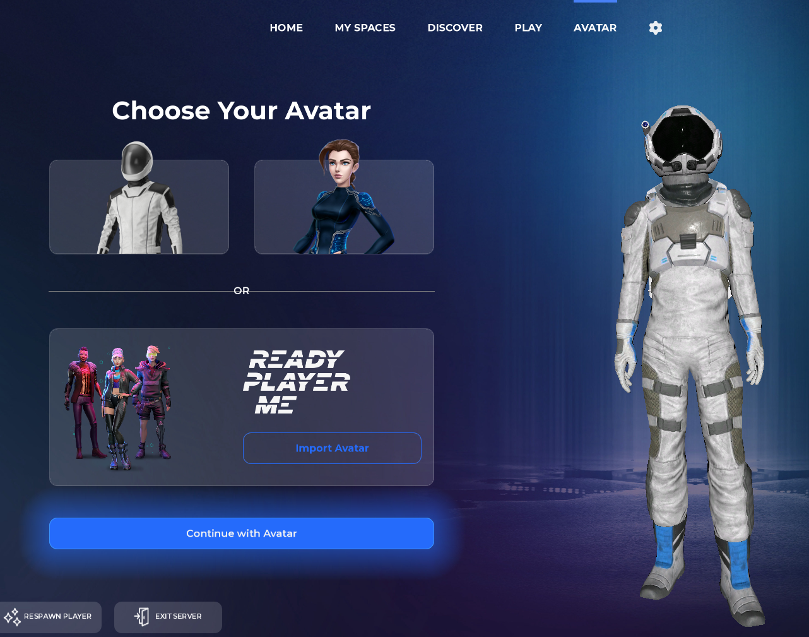

import Tabs from '@theme/Tabs';
import Table from '/src/components/Table';

import TabItem from '@theme/TabItem';

Characters come out-of-the-box in The Mirror, saving you time from building your own player controller. If you're coming from a traditional game engine background, you may be accustomed to building your own player (character) object from scratch.

The Mirror is different from game engines. Similar to Garry's Mod, The Mirror gives you a player controller out-of-the-box. When you begin, you have control of a physical character in the world with smooth controls. This is a fully functional player object that you can use to navigate the game world.

In the future, you'll be able to completely replace this physical character with custom player controllers of your choosing, such as camera adjustments for a top-down strategy game.

# Controlling Your Character

By default, your spawned character follows default FPS (First Person Shooter) and TPS (Third Person Shooter) controls:

<Table
  headers={[`Input`, `Action`]}
  data={[
    [`W`, `Move Forward`],
    [`S`, `Move Backward`],
    [`A`, `Move Left`],
    [`D`, `Move Right`],
    [`Shift`, `Run`],
    [`Space`, `Jump`],
    [`E`, `Interact`],
    [`C`, `Toggle First Person/Third Person Camera`],
  ]}
/>

# Changing Your Character

You can change the character model and even import your own into The Mirror.

- Press `Escape` to open the main menu.

- On the top right, click the "Avatar" tab.

- Currently, The Mirror has two default avatars as seen above. However, you are able to import your own avatar by clicking on the "Import Avatar" button and following the step by step instructions on screen. Alternatively, you can follow the guide [here](/docs/users/ready-player-me.mdx)

- Once you've chosen your avatar or imported your own, you'll need to reconnect to your Space for the change to take effect.
