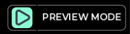

import Tabs from '@theme/Tabs';

import TabItem from '@theme/TabItem';

# Preview Mode

Preview mode is _preview_ of Play Mode: exactly what a player experiences when they play your game.

We've designed Preview Mode to allow you to quickly swap between building and playing while co-building with your team without having to fully publish a game and start from the beginning.

Why?

- No need to enter "cheat codes" to jump to a certain part of your game when testing.
- No need to worry about long compile steps: Just hit "Preview" and experience your Space instantaneously.
- Save time from building your game to testing it and back.

Preview can be activated by clicking the "Preview" button in the top-right of the Build UI.

## Exit Preview

To exit the preview, press `ESC` and click "End Preview" in the bottom-left corner of the screen.

