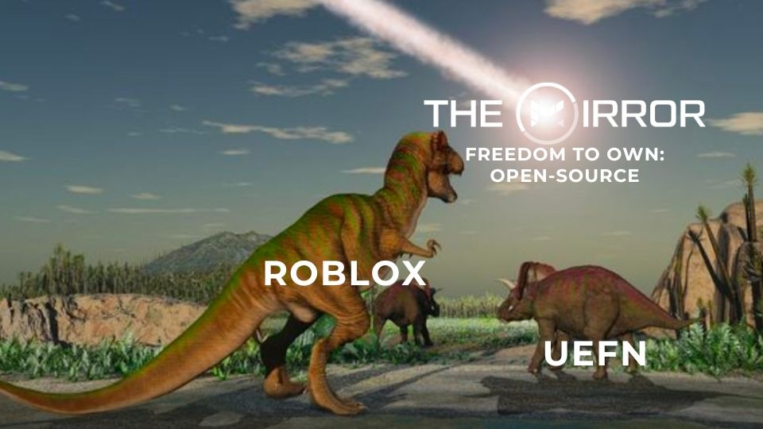

# Contribute

The Mirror is a **community-driven** project, literally created by open-source contributors. We'd love for you to consider contributing to The Mirror! We _**greatly appreciate**_ feedback, suggestions, and additions to the code.

## How to Contribute

### Discussion, Idea, or Proposal

Open an issue on Github and use the `discussion/idea/proposal` label.

### Code

Open a PR on Github and we'd be happy to review.

# Mission & Vision

Read our open-source announcement here: https://www.themirror.space/blog/freedom-to-own-open-sourcing-the-mirror

The Mirror is an open-source all-in-one game development platform, providing everything you need out-of-the-box to make a game/3D experiences, even if you've never written code in your life. The impetus behind labeling it an "open-source Roblox & UEFN alternatve" is because these are the two closest examples. Frankly, we're surprised there aren't more examples, especially with good graphics instead defaulting to cartoony styles.

We hope to change that! :)
