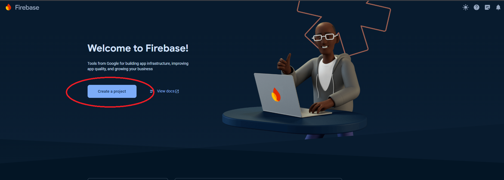
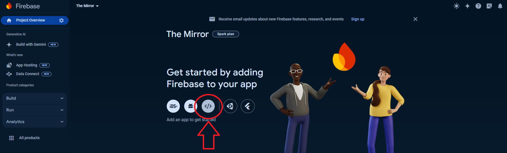
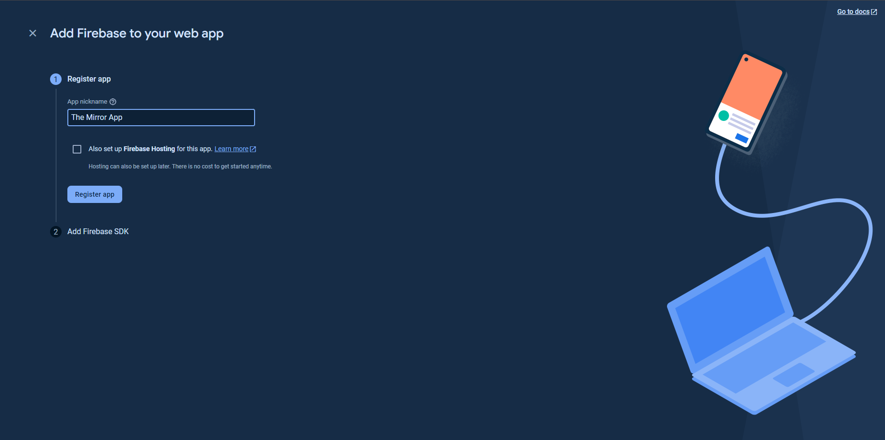
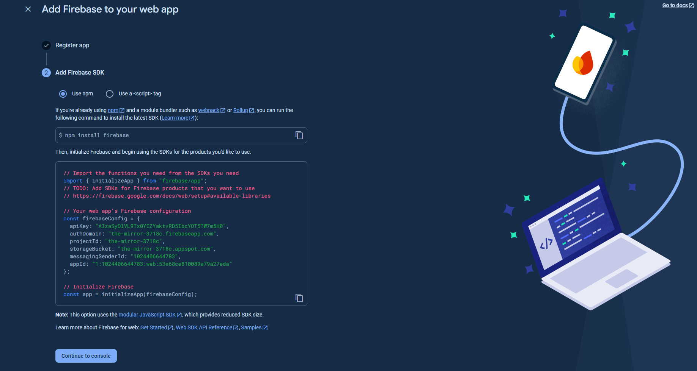
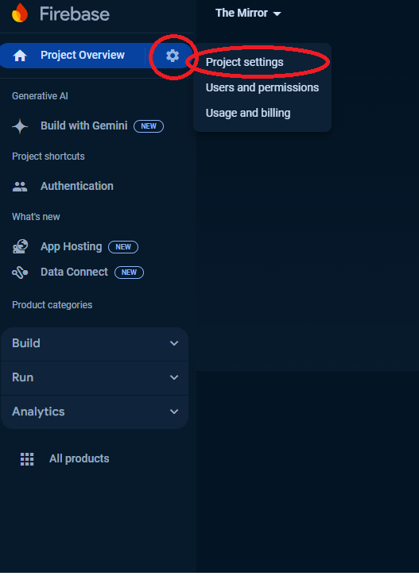
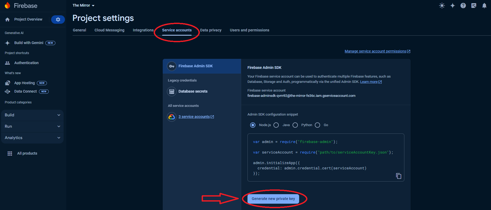
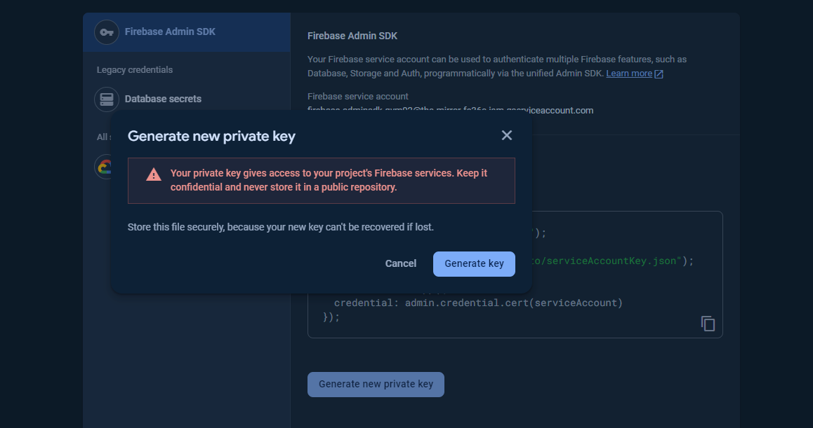
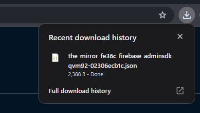

# Creating a Firebase Project

## Prerequisites

Before you start, make sure you have:

- A Google account

## Step 1: Go to Firebase Console

1. Open your web browser and go to the [Firebase Console](https://console.firebase.google.com/).
2. Sign in with your Google account if you are not already signed in.

## Step 2: Create a New Project

1. In the Firebase Console, click on the **Create a project** or **Add project** button.

   

2. Enter a project name. The project name should be descriptive and unique.
   

3. (Optional) You can also set up Google Analytics for your project. If you want to enable Google Analytics, select the **Enable Google Analytics for this project** checkbox. If not, uncheck the box.

4. Click **Continue**.

5. If you chose to enable Google Analytics, you will be prompted to select or create an Analytics account. Follow the on-screen instructions to set up your Analytics settings. Click **Create project**.

6. Firebase will set up your new project. This might take a few moments. Once the setup is complete, click **Continue** to proceed to your project dashboard.
   

## Step 3: Create Firebase App

1. In the project overview page, click the **Web** icon to create a new web app.

   

2. Register your app by entering a nickname for your web app and optionally set up Firebase Hosting.
   

3. Click **Register app**.

4. Firebase will generate a Firebase SDK snippet for you. To continue, click "Continue to console"
   

## Step 3: Generate service account JSON

To interact with Firebase services programmatically, you need to generate a service account key file. Follow these steps to create the JSON file:

1. In the Firebase Console, click on the **gear icon** next to **Project Overview** and select **Project settings**.

   

2. Go to the **Service accounts** tab.

3. Click the **Generate new private key** button.

   

4. A dialog will appear. Click **Generate key** to confirm.

   

5. Your browser will download a JSON file containing your service account key. Save this file securely as it contains sensitive information.

   
