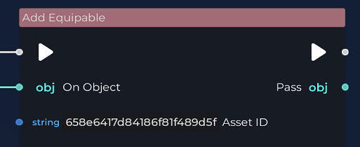

# NPC Basic

The Mirror provides a method for creating NPCs using Visual Scripting. In this tutorial, we will create a humanoid NPC that gives a weapon to the player each time they interact with it.

## The NPC Model

The initial requirement is to create the NPC model, rig it, animate it, and finally export it as a GLB file. Once the GLB file is ready, you can easily import it into The Mirror by drag and drop.
At this stage, the NPC is prepared, and all that is necessary is to drag and drop it into the scene.

## Interact

At this stage, we can proceed with the script creation. Select the NPC model, open the script tab, and click the 'Add Script' button.

Select 'New Script' and create a Player Interact script.

## Animate the NPC

The concept is to animate the NPC every time the player interacts. To achieve this, you'll utilize the PlayAnimation node, illustrated below.

Interacting with the NPC will cause the NPC model to animate.

## Let's make the NPC talk.

We want our NPC to talk or emit a sound when the player interacts, to make it alive. To accomplish this, we can use the PlayAudioClip node.

This node plays the audio clip we specify using the AssetID. The first step is to import our audio clip; you can simply drag and drop a WAV file. Then, select the audio file to open the detail menu and use the button to copy the asset ID.

Then, paste the asset ID into the asset ID parameter, on the PlayAudioClip node.

## Add Equipable

The final part of our script involves instructing the NPC to equip the weapon to the player. This can be accomplished using the AddEquipable node.

Please ensure that you specify the Weapon asset ID, which you can copy as we did for the Audio Clip above. Additionally, you can utilize the ClearEquipable node to remove any equipable item from the player before assigning a new one.

# Conclusion

Interacting with an NPC grants the player a weapon. This script serves as a simple template that can be expanded to create more intricate NPCs, such as companions who assist the player throughout their journey.
