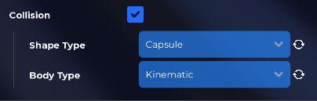

# NPC Walking

We have already covered the creation of a basic NPC in the previous article, where it gives a weapon to the player upon interaction. In this article, we will expand on that by creating a script to make the NPC move to a specific location.

## The SpaceObject properties

The prerequisite for enabling NPC movement is to set the Body Type to Kinematic and the Shape Type to Capsule.

## Script

Now that the NPC is prepared for movement, add a Player Interact Script (as done in the previous article), and then add a MoveTo node.
The MoveTo node instructs the SpaceObject to move to the specified location while avoiding obstacles.

Following is the list of properties it accepts:
- OnObject: The SpaceObject to move.
- Location: The destination location.
- Acceleration: The change in velocity the capsule takes when moving.
- Deceleration: The change in velocity the capsule takes when stopping.
- MaxSpeed: The speed the SpaceObject tries to maintain.
- StepHeight: The height the SpaceObject can step up. It's useful for walking up stairs.
- MaxPushForce: The maximum amount of pushing force this SpaceObject can generate when touching another SpaceObject.
- SupportingHeight: Starting from the ground, indicates the part of the capsule that supports the SpaceObject even on steep slopes.
- Gravity: The constant downward acceleration.
- MinDistanceFromTarget: Specifies the distance that the SpaceObject tries to maintain from the target.
- MaxDistanceFromTarget: When it's more than 0 and the distance from the target is greater, the SpaceObject moves toward the BaseLocation instead of toward the TargetLocation.
- BaseLocation: The location the SpaceObject moves toward if the target is too far.
- SteeringRayOffset: The ray casted by the steering algorithm is offset.
- SteeringRayLength: The ray length used for steering. The longer it is, the sooner the SpaceObject will react to obstacles.
- SteeringRayRadius: The ray thickness.
- SteeringIgnore: The array containing all the SpaceObjects/Players the steering has to ignore.
- RotationOffset: The model rotation offset, used to re-orient the model.

# Conclusion

In combination with the MoveTo node, it is possible to use the PlayAnimation node (as explained in the previous article) to make the NPC walk around.
You can use the MoveTo node in conjunction with the ProcessEveryFrame node to create complex NPCs, such as zombies.

