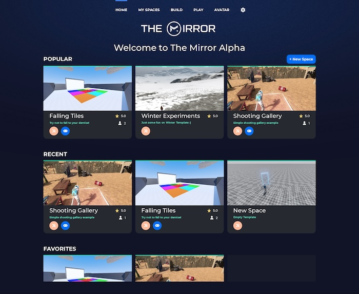
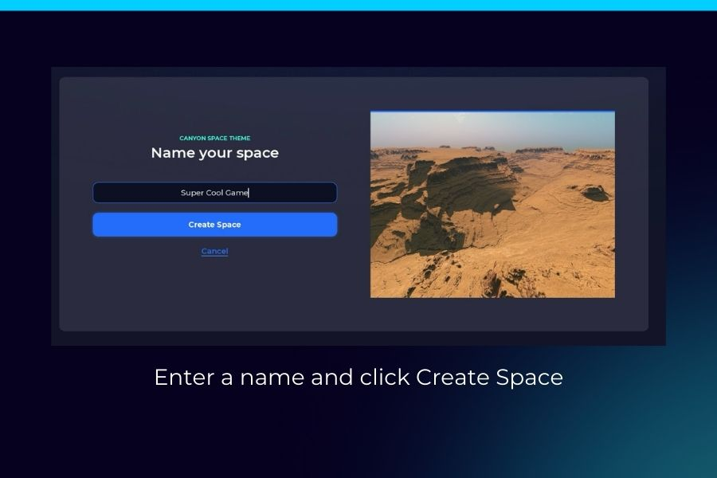
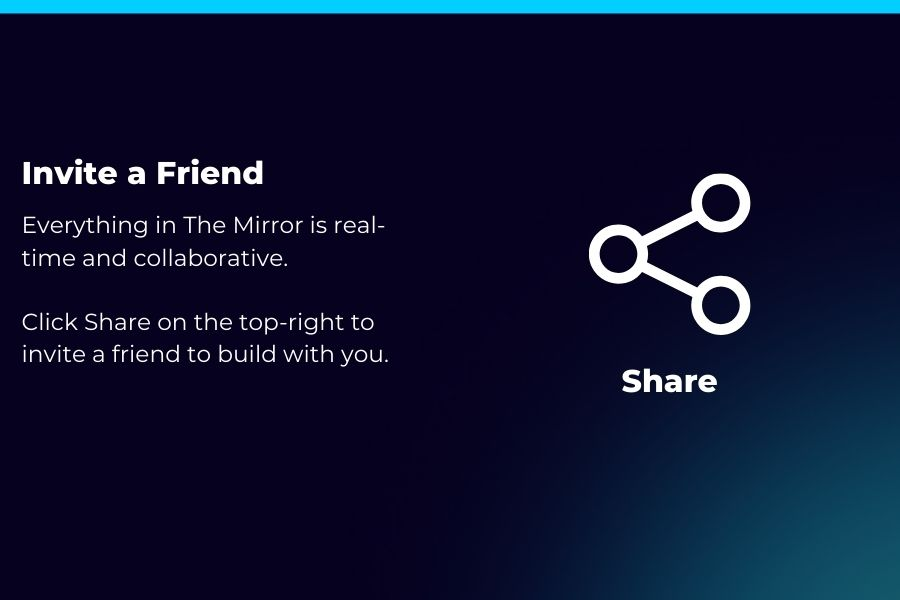
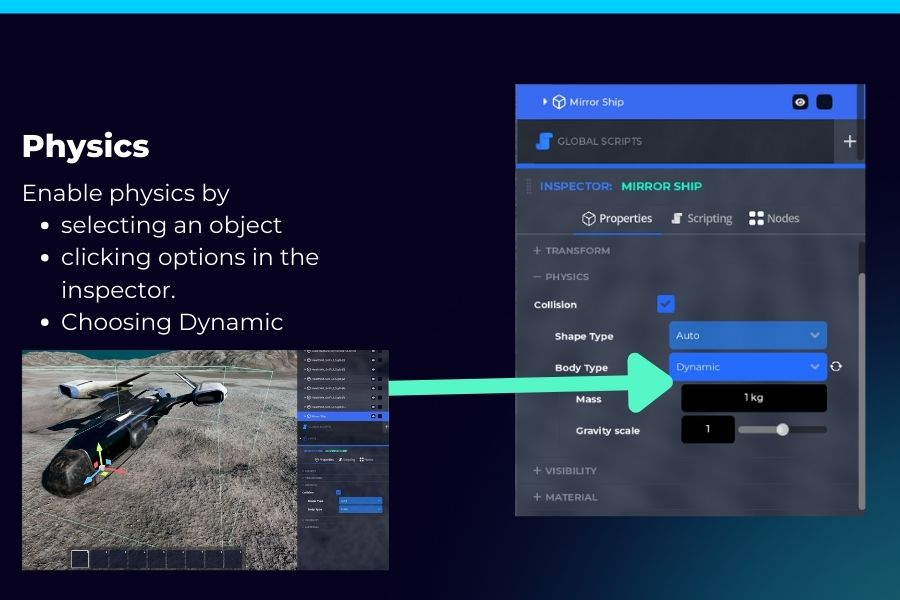

import YouTube from 'react-youtube';

# Tutorial

## Make Games in The Mirror: Tutorial Series

As of May 2024, we're beginning to release videos on our tutorial series, Make Games in The Mirror! Subscribe to our [Youtube](https://www.youtube.com/@themirrorgdp) to stay posted.

<YouTube videoId="JBFUdmNe6rI" />

## How is The Mirror different?

**Everything in The Mirror is in real-time**. In nearly every other game development platform or engine, you'll need to tediously build and compile your game and wait for it to load, which leads to long feedback cycles.

In The Mirror, you can build your game and play **_instantly_** in real-time with friends, colleagues, and players. Check out a comparison of features to other game engines and platforms [here](https://themirror.space/features).

On this page, we'll walk you through how to get started creating your first Space (game) in The Mirror.

:::info Alpha
The Mirror is in Alpha, so you may encounter bugs or issues.

Join our [Discord](https://themirror.space/discord) community to get support and provide feedback.
:::

### Main Menu

When you first open The Mirror, you'll be greeted with the Main Menu. From here, you can create a new Space, play a Space, or join a Space.

### Create Your First Space

A Space is a game or experience in The Mirror. To create your first Space, click the **Create Space** button on the home screen.

### Choose a Template

The Mirror offers a variety of templates to help you get started. You can also start from scratch by choosing the **Empty** template.

### Name Your Space

Give your Space a name and click **Create**. Don't worry, you can change the name later.

## Build Your Space

After you create your Space, you'll be taken inside! From there, begin building via the Build UI by pressing `B`.

### Build UI

Press `B` to open The Build UI, the "Editor" for your Space, similar to the editor for a game engine. The Mirror has the full power of a game engine while providing **everything** you need to make a game in a simple and intuitive interface.

### Invite a Friend

Since everything's in real-time, you can invite a friend to join you in your Space. To invite a friend, click Share on the top-right of the screen and copy the link. Send the link to a friend and they'll be able to join you in your Space.

### Physics

Physics are at the heart of The Mirror. You can enable physics for any Object in your Space by clicking on the Object, scrolling down to Physics, and changing the Body Type.

You can also right-click on the Object and select "Enable Physics".

### Right-Click

Right click on any Object to open the context menu. The context menu allows you to perform actions on Objects, such as focusing, locking, toggling physics, modifying properties, and more.

### Preview Mode

Preview Mode allows you to test your Space without having to publish it. It's an exact **_preview_** of you're Space when you publish it and it's played in Play Mode. You can also invite friends to join you in Preview Mode.

### End Preview Mode

To end the preview, press `ESC` and click the **End Preview** button in the bottom left corner of the screen.

### Publish Your Space

Publishing your Space makes it available to play in Play Mode. To publish, open the Build UI with `B`.

You can choose to publish the current version of your Space or a saved version. Select a version and click **Publish**.

Any player will now be able to play your Space by clicking **Play** on the Space Details page.

:::info Versioning
Versioning can be thought of similar to Google Docs and other version-based software.

You can modify your Space without affecting the published version of your Space. This allows you to work on the next version of your Space while players play the current version.
:::

### Play a Published Space

To play a published Space, simply click **Play**. This will join the first available server.

You can also create a new server by clicking **Create Server**.

### Visual Scripting

Visual Scripting is one of the most powerful features of The Mirror. It allows you to create interactive experiences without writing a single line of code, even if you've never written a line of code in your life.

If you prefer to write code, we'll be releasing in-world GDScript and shaders in the future!

Check out our [Visual Scripting](/docs/category/scripting) documentation for more information.

## Next Steps

Now that you've created your first Space, you can start building your own worlds. Head to the [Build section](/docs/category/build) next.
