import Tabs from '@theme/Tabs';
import Table from '/src/components/Table';

import TabItem from '@theme/TabItem';

# Build UI

## What Is the Build UI?

Building is at the heart of The Mirror. It is a collection of tools that allows you to manipulate your Space and aid you in brining your imaginations to the virtual world.

You can activate the _Build UI_ by pressing `B` on your keyboard.

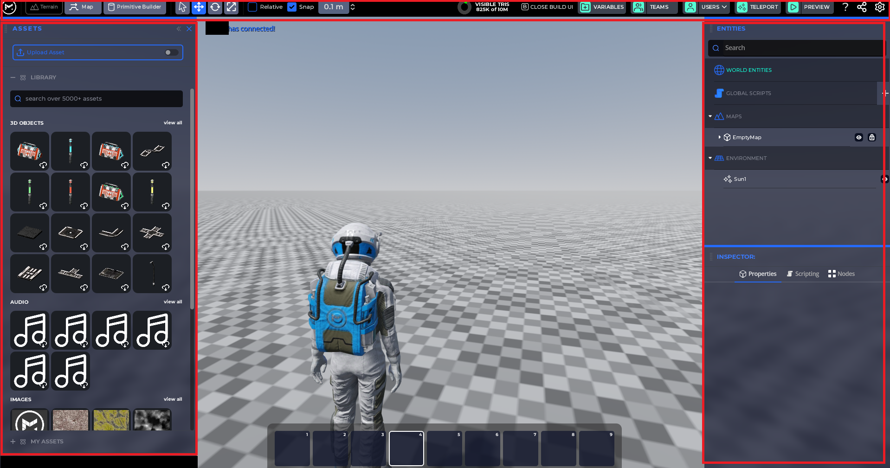

## Controls In Build UI

When you're in the _Build UI_ you no longer control your character and it remains stationary. The controls for moving around are slightly different:

<Tabs queryString="os">
{[
{label: "Windows", value: "windows", cmdCtrlKey: "CTRL"},
{label: "Mac", value: "mac", cmdCtrlKey: "CMD"},
{label: "Linux", value: "linux", cmdCtrlKey: "CTRL"}
]
.map((os) => {
  {/* React MDX isn't working here for some reason. Should be able to use the below */}
  const cmdCtrlKey = os.cmdCtrlKey
  const headers = [`Input`, `Action`];
  const data = [
    [`Hold Right Mouse Button`, `Look around`],
    [`W + Hold Right Mouse Button`, `Move forwards`],
    [`S + Hold Right Mouse Button`, `Move backwards`],
    [`A + Hold Right Mouse Button`, `Move left`],
    [`D + Hold Right Mouse Button`, `Move right`],
    [`Mouse Wheel Scroll + Hold Right Mouse Button`, `Increase/decrease movement speed`],
    [`Mouse Wheel Scroll`, `Zoom in/out`],
    [`Right Mouse Button`, `Open context menu`],
    [`${cmdCtrlKey} + D`, `Duplicate object`],
    [`Move object + Hold Shift`, `Duplicate object`],
  ];
 return <TabItem value={os.value} label={os.label} default>
  <Table headers={headers} data={data} />
</TabItem>
})}

<TabItem value="vr" label="VR">

:::note Coming Soon
VR is next on our list! Let us know if it's something you're interested in.

[Feature Board!](https://in.themirror.space/feedback)

:::

</TabItem>
<TabItem value="mobile" label="iOS/Android">

:::note Future
Mobile apps aren't ready yet, but let us know if you'd like this!

[Feature Board!](https://in.themirror.space/feedback)

:::

</TabItem>
</Tabs>

--

The _Build UI_ is divided into three different panes:

1. The "Main Toolbar" is at the top of the screen.
2. The "Assets Window" is on the left side of the screen.
3. The "Entities & Inspector Window" is on the right side of the screen.

## The Main Toolbar

On the left side of the main toolbar, there are three buttons that allows you to switch between _Terrain_ manipulation, _Map_ and _Primitive Builder_.

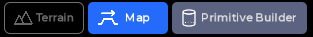

By default you're in _Terrain_ manipulation mode when you are in the _Build UI_. At the moment, terrains can't be manipulated directly in The Mirror -- we're currently working on this feature and will be available soon. That said, you can import terrains from 3rd party programs like [Gaea](https://quadspinner.com/).

The second button in the main toolbar is the "Map" button. Clicking it will activate _Map Mode_. A map in The Mirror refers to the ground objects in a Space (terrain is an example). Activating _Map Mode_ allows you to create a new map and duplicate the current active one.

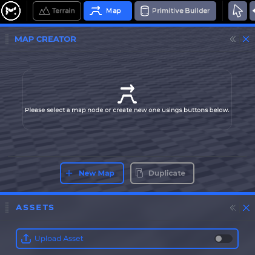

The third button is the Primitive Builder button. Clicking it will activate the _Primitive Builder_. In this mode you can create objects using simple primitive shapes similar to 3D graphics manipulation softwares such as Blender.

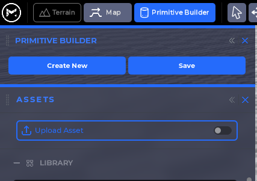

On the right of the aforementioned three buttons, the transformation tools will allow you to manipulate any object in your Space.

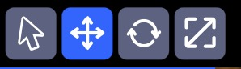

- The first icon is the selection tool that allows you to select different objects. Shortuct `Q`.
- The second icon is the translate tool that allows you to move objects in 3D. Shortuct `W`.
- The third icon is the rotate tool that allows you to rotate objects in 3D. Shortuct `E`.
- The fourth icon is the scale tool that allows you to change the size of objects in 3D. Shortuct `R`.

Next to the above buttons there are helper options you can choose to enable to help you transform objects easier.

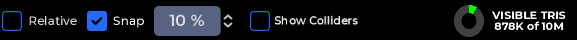

- The "Relative" checkbox will toggle between world and local Space. When unchecked, whenever you move, rotate or scale an object, you do so independent of the orientation of the object and do it based on the absolute world axes. However, when you enable relative, you will be moving, rotating or scaling the object based on its own orientation and axes.
- The "Snap" checkbox will enable snaping while the drop down menu next to it will allow you to choose the snap iteration amount.
- The "Show Colliders" is currently a work in progress; we're working on making it available soon.
- The "Visible Tris" will display how many tris are currently drawn in your current view as well as your maximum tris budget.

On the right side of the main toolbar you'll find the below buttons:

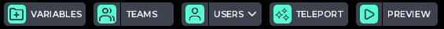

- The `Variables` button will display all the available variables and you can add, edit and remove them. By default The Mirror has a few already made variables you can leverage such as player health, location and more.

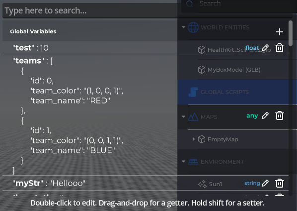

- The `Teams` button will display the list of teams available. This is useful in many multiplayer game types. By default there are two teams; red and blue. This view allows you to add or delete teams.

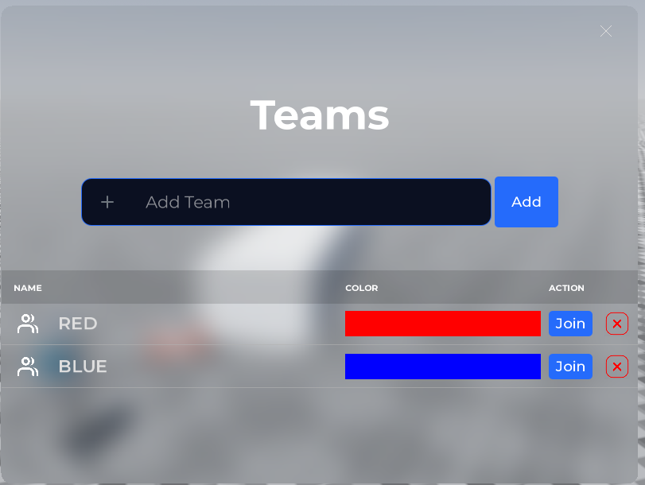

- The `Users` button will display a list of users that are currently located in your Space.

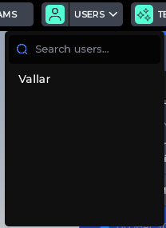

- The `Teleport` button will help unstuck and teleport your character.
- The `Preview` button will allow you to test your game by running it as if it is fully published without having to compile or publish your Space.

:::note

To exit _preview mode_, press `Escape` and then click on the `End Preview` button at the bottom left of the screen

:::

Next to the `Preview` button there are three helper buttons:

- The `?` button will open the on-screen quick tutorial.
- Next to the help button there is the `Share` button. This will allow you to share your Space with others via a link to make it easier to collaborate and work with others in the same Space.
- The `Options` button denoted by a cog will bring up Basic Space Settings as well as access to the main menu.

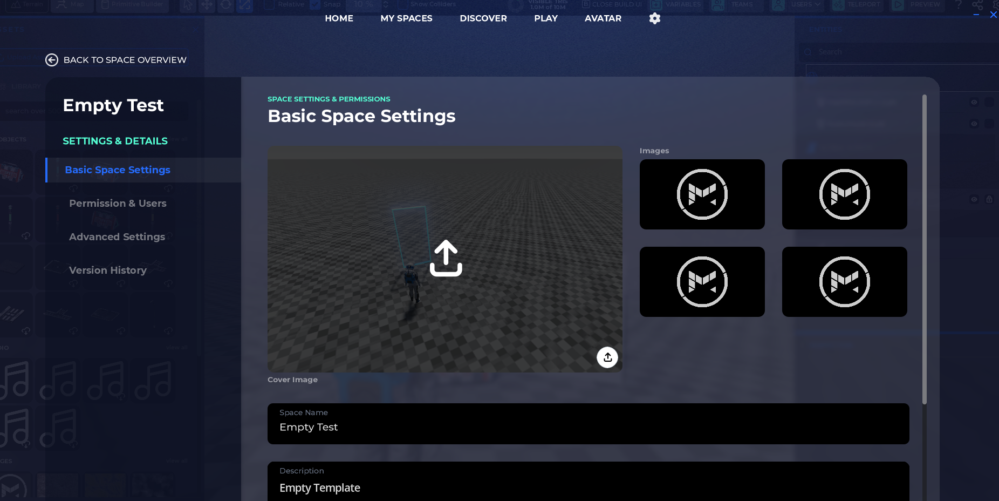

## The Assets Drawer

The Assets Drawer is located on the left pane in the _Build UI_ this has a list of all the assets (3D models, textures, etc...) available in your library. These assets could be custom created, imported or provided by The Mirror. This is similar to the project view in other engines.

The Assets Drawer is divided into two sections; the "Libarry" and the "My Assets" section. The library is basically any assets that The Mirror provided or shared by users publicly. The my assets section (found at the bottom) will only display the assets you've created or imported into The Mirror yourself.

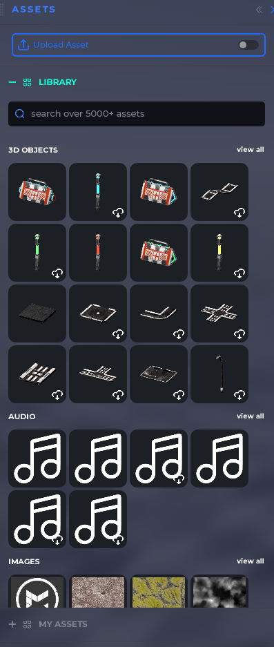

## Entities View

The Entities View is located on the right side in the _Build UI_ and it lists all the available entities in your Space. From maps to global scripts.

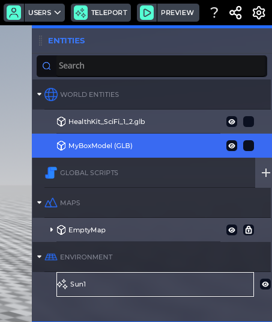

The Entities View is divide into four main categories:

- World Entities; these are entities you've placed in your world such as a health kit, a weapon or even a staircase. You are able to toggle these entities visible or not (eye icon on the right side of the entity) or lock it to prevent accidental selection or transformation of said object (checkbox next to the visibilty toggle).

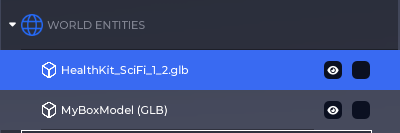

- Global Scripts; these are scripts that apply to your entire game, they are not attached to an object and are always active. An example of this is a script that checks the score in a game to see if it reached a certain threshold as a win condition. All global scripts have the option to be toggled active or inactive (checkbox next to script's name). You can delete a global script by clicking the trashcan icon next to it.

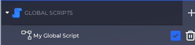

:::note
Instanced scripts -- unlike global scripts, require that they are attached to an object and their scope is local to said object. You can learn more about scripting [here](../script/getting_started.mdx)
:::

- Maps; this lists the current map used in your Space. A map in The Mirror is the terrain or ground used as the base for your level. You are able to toggle these entities visible or not (eye icon on the right side of the entity) or lock it to prevent accidental selection or transformation of said object (checkbox next to the visibilty toggle).

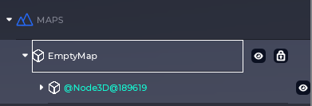

- Environment; these are global environment objects that affect the entire Space. The sun is an example of this. You are able to toggle these entities visible or not (eye icon on the right side of the entity).

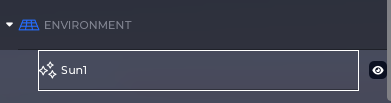

## Inspector View

The Inspector View is where all the properties and options of a selected object will be displayed. Through the inspector you will be able to modify the different properties of the objects, from position and scale to collision and any scripts that may affect it.
When selecting an object three main tabs will appear; properties, scripts and nodes. The properties tab will offer basic information and allow you to modify them. The nodes tab will allow you to add or remove any nodes available for the object. Finally the scripts tab will allow you to attach, edit or delete any scripts available for the object.

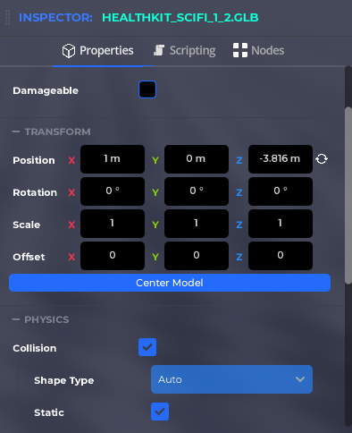 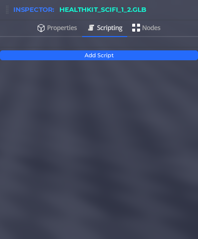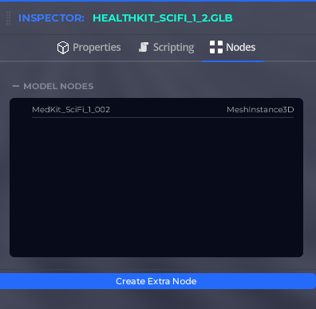

:::note
Nodes is a concept inherited from Godot. For more information about what they are, please check out [Godot's documentation article about them](https://docs.godotengine.org/en/stable/getting_started/step_by_step/nodes_and_scenes.html)
:::
