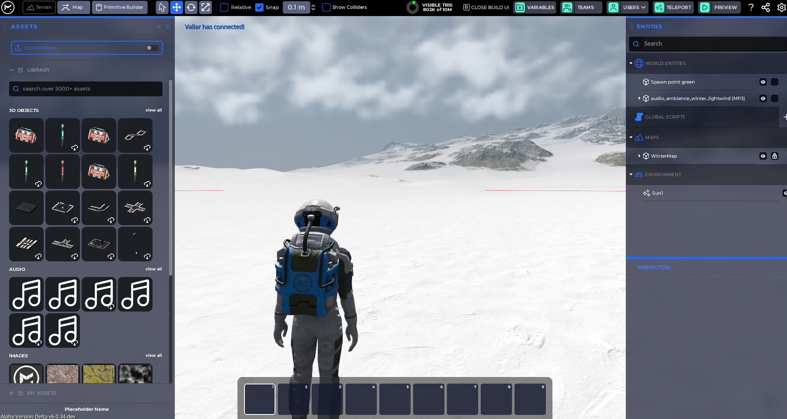

import Tabs from '@theme/Tabs';
import Table from '/src/components/Table';

import TabItem from '@theme/TabItem';
import YouTube from 'react-youtube';

# How to Import

The Mirror allows you to import custom assets to create your games, such as 3D models, audio files, textures, height maps, and more.

It's important to understand the requirements to ensure a smooth importing experience. The Mirror is built on top of Godot, which means it inherits many of the requirements that Godot would expect when importing the asset.

NOTE: We strongly suggest importing .GLB files as they include all materials and other dependencies in a single file, similar to a .ZIP file.

## How To Import an Asset

- Enter Build Mode: In a Space, press `B` on your keyboard to open _Build Mode_.

- On the left side, you'll find the Assets Drawer. Click on the switch next to "Upload Asset".

- Drag your file from your system's folder into the drop area or click "Browse".

- If you clicked "Browse", navigate to its location, select it, and click "Open" button.

- A message will popup to notify you with the import process status.

You'll find your imported asset under "My Assets" in the Assets Drawer.

## Import on the Web App: [in.themirror.space](https://in.themirror.space)

1. Click "My Assets" on the sidebar
   

2. Click "+ New Asset" on the top-right of the screen.

3. Enter the information about your asset.

4. Upload the asset's file

