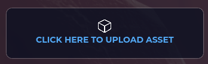
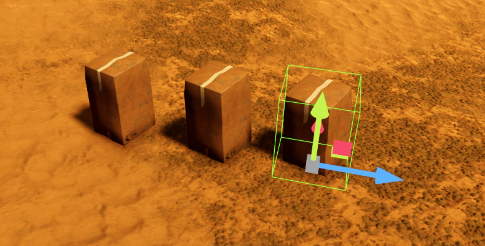
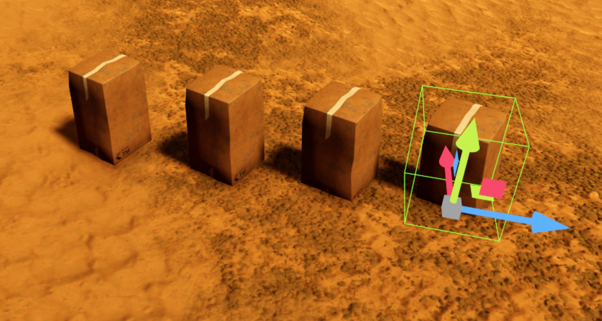
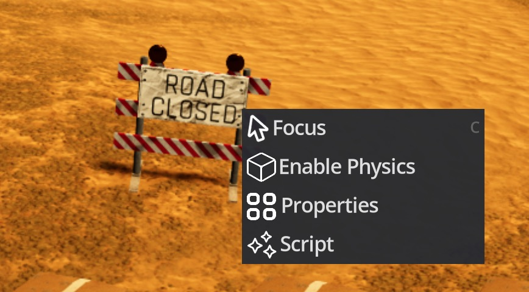

import Tabs from '@theme/Tabs';
import Table from '/src/components/Table';

import TabItem from '@theme/TabItem';
import YouTube from 'react-youtube';

# Objects

# Create an Object

An object is simply an Asset that's in a Space. You can place as many Objects as you wish in-world, and they can all reference the same Asset.

## In-World

Assets can be uploaded by clicking "Click Here to Upload Asset" from the Asset Drawer.

Any Object created in-world will automatically show up on https://in.themirror.space.

## Shift+Drag Duplicate Objects

You can duplicate an object by Shift + Dragging on a gizmo.

## Copy/Paste Objects

When an object or group of objects is selected, press CTRL/CMD+C and CTRL/CMD+V to copy and paste an object. The pasted object will appear where your mouse is.

## Right Click Menu

Right-click on an Object to open the context menu.

## Web: [in.themirror.space](https://in.themirror.space)

Placing an Object is currently only possible in-world.
