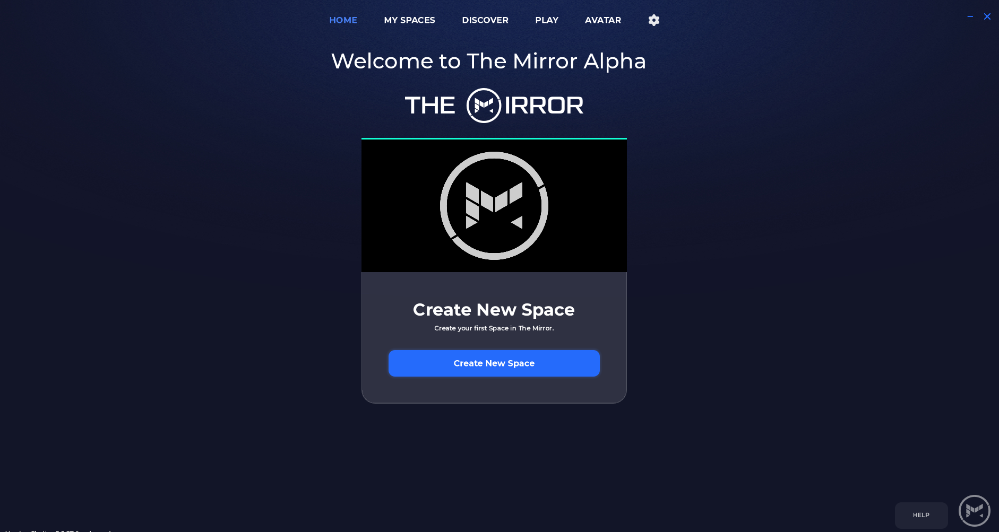
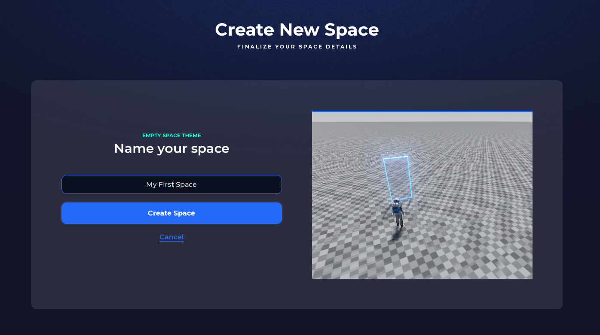
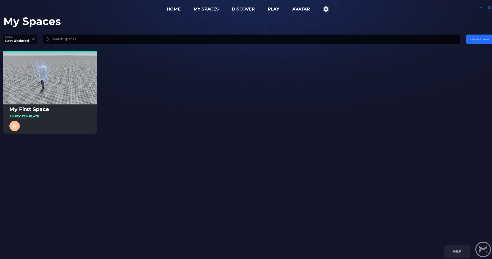
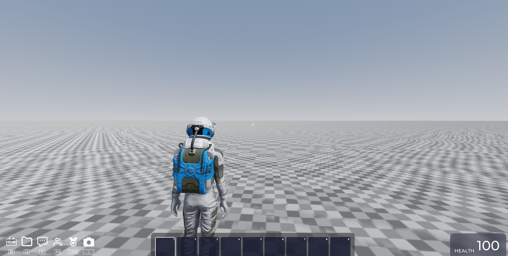
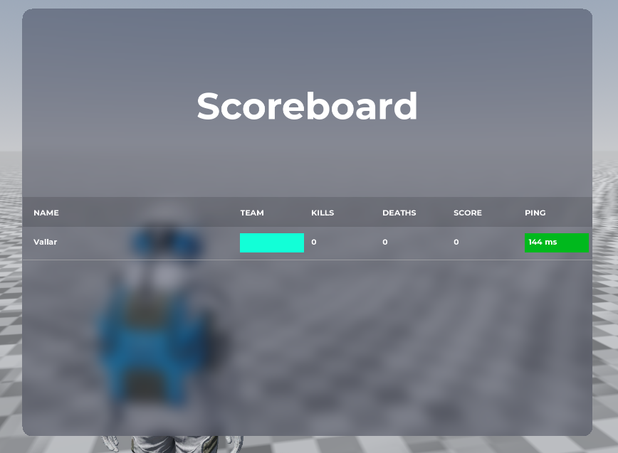
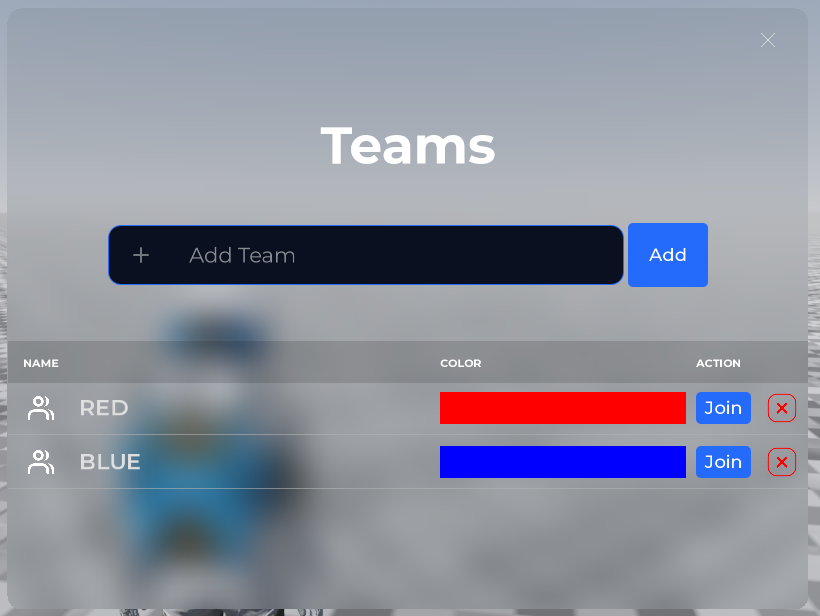
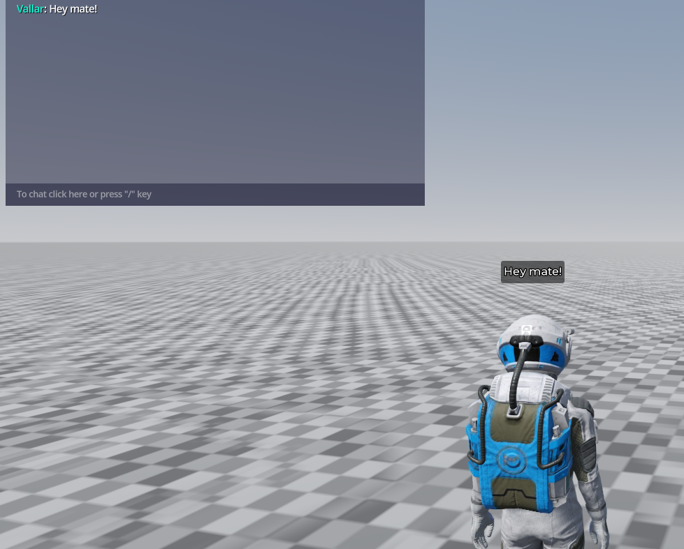
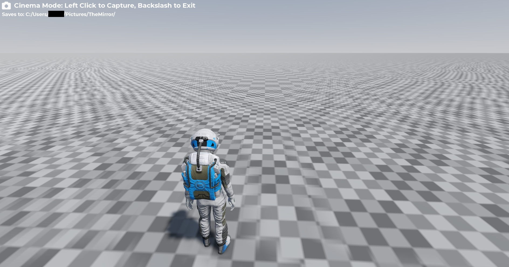

# Spaces

Spaces in The Mirror means two things; a fully functional game published and ready for players to enjoy or a project that a user is currently developing. In other words, it is a game that can be modified or published.

When you launch the app and log in you're greeted with the landing page.

There are four main tabs at the top of the page as shown above; **Home**, **My Spaces**, **Build**, **Play**, **Avatar** and the cogwheel icon representing the settings menu.

- **Home** page is where you land by default after logging in, it displays the recent Spaces you've visited as well as the ability to create new ones.

:::note
In The Mirror, projects, games, worlds are called Spaces. You'll find a list of all the Spaces you've worked on under **My Spaces** tab.
:::

- **Build** will list all the Spaces you or other people created and made public for anyone to check out. Spaces have various default permissions: Observer, Contributor, or Manager.
- **Play** will showcase all the current published games available for anyone to play and enjoy.
- **Avatar** will allow you to customize your in-game avatar that will be used across the different Spaces. For more information check the [Changing your character](/docs/build/Character) section.
- In **Settings** you can change and customize the way The Mirror works, from graphics settings to controls.

# Creating A Space

- Navigate back to **Home** page and then click on "Create New Space".
- **My Spaces** page will load the "Create New Space" page which lists all the available templates as shown below.

:::note
Templates save you time during game development. Each of the templates offered has a basic terrain and suitable lighting to help you create your game faster. Instead of you hunting down for hours and looking for assets to create a test desert level or an oasis to help set up your lighting, it is there ready and set up for you.

Right now, The Mirror has 6 different environments to get you started; Badlands, Canyon, Desert, Mars, Mountains and Winter.
:::

- For this example, we'll choose the "Empty Template".

- A dialogue box will show up asking you to give your Space a name. We'll call it "My First Space" but you're free to call yours whatever you want. Click on "Create"

- In a few seconds you should see your Space created and is available for editing and is fully playable.

- Click on the round orange button at the bottom left of the Space card titled "Build" as shown above to start editing the Space.

:::note
Clicking on the card itself instead of the "Build" button will open the project settings.
:::

- After loading in, this is what you should see:

When creating any new Space, The Mirror will automatically provide you with a few tools to get you started on your creative adventure:

1. A fully functional player object that allows you to explore the Space and acts as your main character during the building and testing processes. You can read more about characters [here](/docs/build/Character)
2. A scoreboard in case your Space needs one.

3. Given The Mirror is built with multiplayer in mind, your Space is created with the ability to have different teams and your character will belong to one of them by default.

4. A chat system so you can chat with other players and your co-creators.

5. Cinema mode to allow you to capture beautiful screenshots to showcase your creation.

Now that you have a created Space, the sky is the limit: build the world and games you've been dreaming of.
