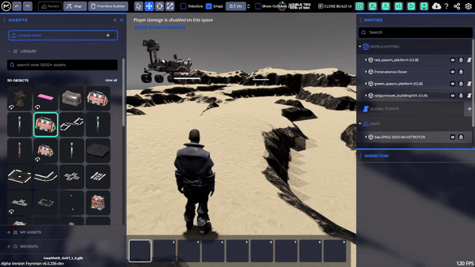
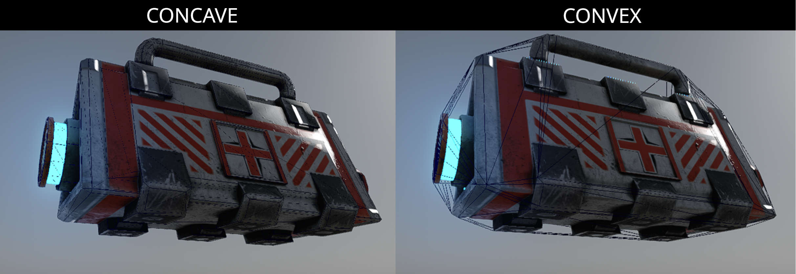
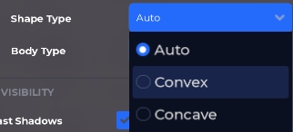
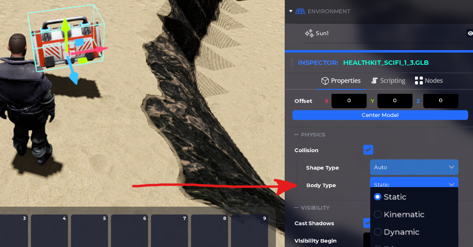
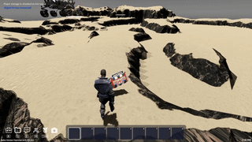
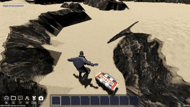
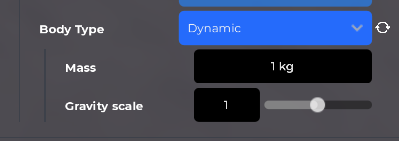
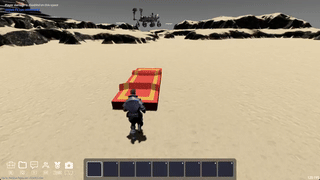
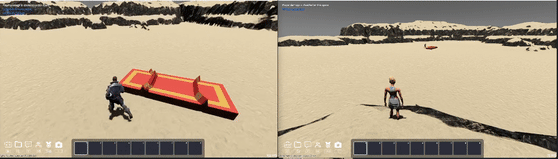

import Tabs from "@theme/Tabs";
import Table from "/src/components/Table";

import TabItem from "@theme/TabItem";
import YouTube from "react-youtube";

# Getting Started

Working with physics in The Mirror is easy. Everything is exposed using high-level APIs. Even beginners can quickly create complex scenes with physics simulations and physics-enabled gameplay.

The Mirror includes a custom implementation of [Jolt Physics](https://github.com/jrouwe/JoltPhysics), an advanced physics engine. All physics features are networked out of the box, such that all of the physics is synced between the server and all clients.

This article explains the most essential features of The Mirror's physics, including `SpaceObject`s, body types, shape types, importing shapes from models, and how to apply forces and impulses.

## The SpaceObject

The `SpaceObject` is any object that can be placed into the space, like an imported asset. They are usually instances of 3D models from glTF files, but can also be instances of other asset types. `SpaceObject` has a transform and properties to define its physical behavior. Objects can be spawned by dragging and dropping an asset from the asset library. Objects can be deleted by selecting them and pressing the <kbd>Delete</kbd> key.

## SpaceObject's Physical Properties

You can manipulate the position and rotation of a `SpaceObject` by dragging it using one of the colored arrows with their tails at the object's origin. The arrows are part of a tool called the Gizmo. You can change the object's physical behavior by modifying the physics properties in the inspector panel. Only objects with collision enabled will interact with the physics engine.

### Shape Type

All SpaceObjects with collision enabled have a shape type. The shape type defines the shape of the object's collision bounds. The available options depend on the model you imported.

- **Concave** is the most accurate collision shape, but it is the slowest, and can only be used with static objects. In a concave shape, each triangle from the model's meshes are used for collision. Concave is useful for meshes representing objects you can go inside of, like houses.
- **Convex** is much faster than Concave. Convex simplifies the shape to be a convex hull with no holes or dips. Convex shapes are "filled in", they are not hollow. Non-concave shapes like Convex can be used for moving objects and triggers. Convex is suitable for most dynamic props, like barrels.
- **Model Shapes** allows glTF 3D model files to provide their own collision shapes using the [`OMI_physics_shape`](https://github.com/omigroup/gltf-extensions/tree/main/extensions/2.0/OMI_physics_shape) extension. When this data is present in the file, this is usually the best option. Having a glTF 3D model file provide its own physics shapes is the only way to have boxes, spheres, capsules, and cylinders, which are simple primitives that are faster than both Concave and Convex. You can make a glTF file that uses `OMI_physics_shape` by exporting a .glb file from [Godot Engine](https://godotengine.org/) version 4.3 or later.
- **Multi Bodies** is an advanced option available for glTF 3D model files that provide multiple bodies using the [`OMI_physics_body`](https://github.com/omigroup/gltf-extensions/tree/main/extensions/2.0/OMI_physics_body) extension. This option is useful for including many independently moving parts in one model, like a rube goldberg machine, a ball pit, a hanging rope, etc.
- **Auto** is the default shape type. It will automatically select the best option for the model. It will try to use Model Shapes if available and suitable, otherwise it will use Concave for static objects and Convex for non-static objects.

If your asset does not provide its own physics shapes, you will not see Model Shapes or Multi Bodies as available options in the dropdown. For most objects, the dropdown will look like this:

### Body Type

All SpaceObjects with collision enabled have a body type. The body type defines how the object moves and interacts with other objects. There are four body types: Static, Dynamic, Kinematic, and Trigger.

#### Static

The **Static** body type is for objects that don't move. This type is used for things like terrain, buildings, and props that are intended to be fixed in place. Static bodies can be teleported with scripts, but do not support smooth motion.

#### Dynamic

The **Dynamic** body type is for objects that move via forces. This is often referred to as rigid body dynamics. This type is used for moving objects, like barrels. Dynamic bodies are affected by gravity. Dynamic bodies can be pushed or stopped by all other solid objects, including other dynamic bodies, static bodies, kinematic bodies, and characters.

The ideal way to move a dynamic body in user script is to apply forces to it with the [Apply Force Over Time](/docs/script/vs_api_reference#apply-force-over-time) or [Apply Force Impulse](/docs/script/vs_api_reference#apply-force-impulse) script blocks. This can be used to push around objects realistically, simulate impacts or explosions, etc.

#### Kinematic

The **Kinematic** body type is for objects that move via scripts. This type is used for finely controlled movement such as a moving platform. Kinematic bodies are not affected by gravity. The ideal way to move a kinematic body in user script is to [set its velocity](/docs/script/vs_api_reference#properties), either Linear Velocity or Angular Velocity, or use the [Move And Collide](/docs/script/vs_api_reference#move-and-collide) script block.

#### Trigger

The **Trigger** body type is for non-solid objects that can be used to detect when other objects enter or exit them. This type is used for things like checkpoints or traps. Triggers are not affected by gravity. Triggers may have a velocity specified like with Kinematic. Triggers are not solid and will pass through all other bodies.

You can detect when a body enters a trigger using the [On Body Entered Trigger](/docs/script/vs_api_reference#on-body-entered-trigger) signal in visual scripting. Note that this signal is only available if the Body Type is Trigger, or if there is a Trigger subnode. Similarly, you can detect when a body exits a trigger using the [On Body Exited Trigger](/docs/script/vs_api_reference#on-body-exited-trigger) signal in visual scripting.

### Mass and Gravity scale

Mass and gravity scale are additional physics properties available for dynamic objects (objects that move with forces).

#### Mass

The mass property controls the mass of the object in Kilograms. This is useful to change the weight of a dynamic object, which includes how the body responds to forces and how easily it can be pushed around. A heavier object will take more effort to be pushed.

#### Gravity scale

The gravity scale changes the falling acceleration, and allows to create floating objects. A positive gravity scale will have objects fall in the direction of gravity (usually down). A negative gravity scale will have objects fall in the opposite direction of gravity (usually up). A zero gravity scale will cause the object to be not affected by gravity.

## Move on top of objects

The charcter can walk on top of moving objects. You can use this property to your advantage.

## Networked physics

The physics is networked out of the box, you can enjoy using it with your friends in real time!

