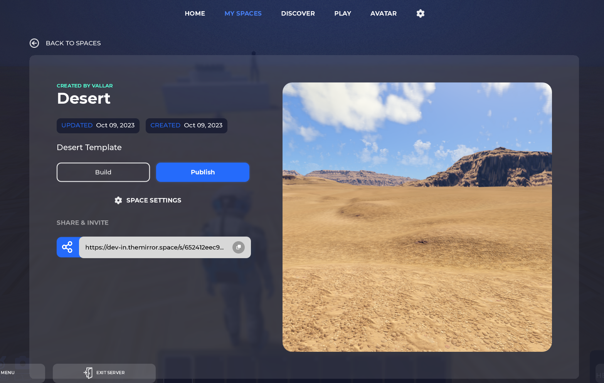

import Tabs from '@theme/Tabs';

import TabItem from '@theme/TabItem';

# Play Mode

When a Space is published, it becomes available for everyone to experience as a fully functional game -- this is called Play Mode. In other engines, this is equivalent to exporting your project and uploading it to any platform. However, everything in The Mirror is in real-time, so no need to worry about long builds and exports.

## How To Publish Your Space

- Launch The Mirror and login using your account. You should see the landing page:

- Switch to the **My Spaces** tab

- Click on the Space card you would like to publish.

- Click the "Publish" button.

- The "Publish" button will change into "Play" instead and you'll get a message notifying you that the Space is published.

If you're connected to a Space and you want to publish it press `B` on your keyboard to open _Build Mode_

- Click on the cog wheel icon at the top right of the Main Toolbar. This will open the settings menu

- Scroll to the bottom and click on the "Publish Game" button.

